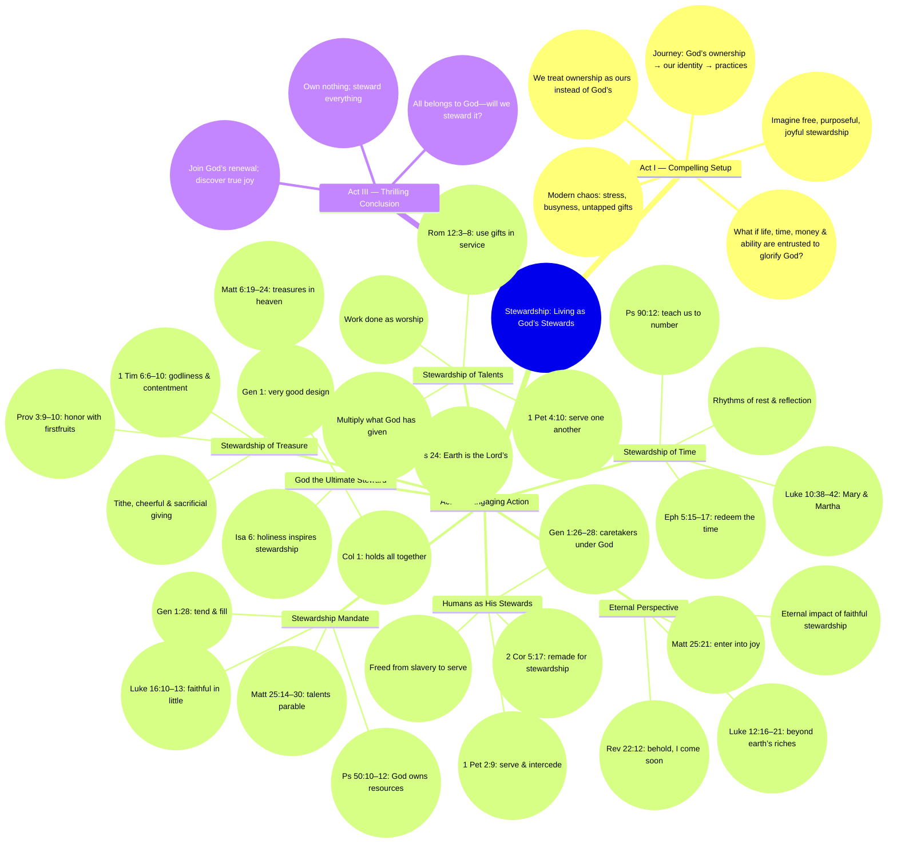

```mermaid
mindmap
  root((Stewardship: Living as God’s Stewards))
    Act I — Compelling Setup
      Hook(("What if life, time, money & ability are entrusted to glorify God?"))
      Relevance(("Modern chaos: stress, busyness, untapped gifts"))
      Challenge(("We treat ownership as ours instead of God’s"))
      Desire(("Imagine free, purposeful, joyful stewardship"))
      Map(("Journey: God’s ownership → our identity → practices"))
    Act II — Engaging Action
      God the Ultimate Steward
        Creator(("Gen 1: very good design"))
        Owner(("Ps 24: Earth is the Lord’s"))
        Sustainer(("Col 1: holds all together"))
        Worship(("Isa 6: holiness inspires stewardship"))
      Humans as His Stewards
        ImageBearers(("Gen 1:26–28: caretakers under God"))
        NewCreation(("2 Cor 5:17: remade for stewardship"))
        RoyalPriesthood(("1 Pet 2:9: serve & intercede"))
        Redemption(("Freed from slavery to serve"))
      Stewardship Mandate
        CreationMandate(("Gen 1:28: tend & fill"))
        Entrustment(("Ps 50:10–12: God owns resources"))
        Accountability(("Matt 25:14–30: talents parable"))
        Faithfulness(("Luke 16:10–13: faithful in little"))
      Stewardship of Time
        RedeemTime(("Eph 5:15–17: redeem the time"))
        Sabbath(("Ps 90:12: teach us to number"))
        Prioritization(("Luke 10:38–42: Mary & Martha"))
        Margin(("Rhythms of rest & reflection"))
      Stewardship of Treasure
        GiveBack(("Matt 6:19–24: treasures in heaven"))
        Contentment(("1 Tim 6:6–10: godliness & contentment"))
        Budget(("Prov 3:9–10: honor with firstfruits"))
        Generosity(("Tithe, cheerful & sacrificial giving"))
      Stewardship of Talents
        GiftsServe(("Rom 12:3–8: use gifts in service"))
        Vocation(("Work done as worship"))
        Growth(("Multiply what God has given"))
        Community(("1 Pet 4:10: serve one another"))
      Eternal Perspective
        Rewards(("Rev 22:12: behold, I come soon"))
        WellDone(("Matt 25:21: enter into joy"))
        Legacy(("Luke 12:16–21: beyond earth’s riches"))
        Fruitfulness(("Eternal impact of faithful stewardship"))
    Act III — Thrilling Conclusion
      Climax(("All belongs to God—will we steward it?"))
      Decision(("Own nothing; steward everything"))
      Transformation(("Join God’s renewal; discover true joy"))
```